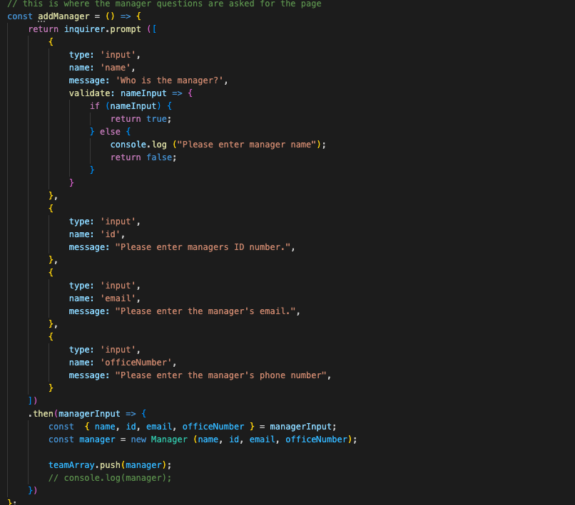
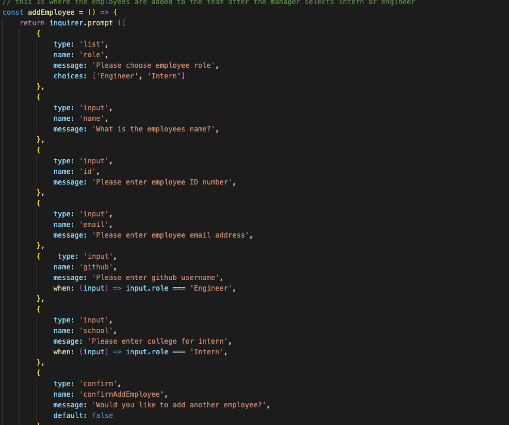
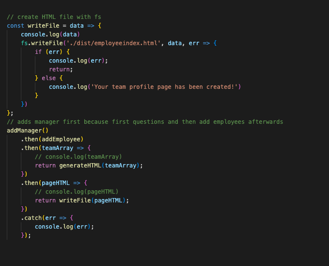

# Team Profile Generator
  
  ## Description
  This project is used to create a team profile using Node JS in the terminal.  It gives you multiple choices for answers and you can add the manager along with a engineer or intern or both!

  ## My Task / User Story
  My task is to create a html page with the team heirarchy staring with the manager to show their team by using node to pull from the terminal and create a webpage by itself. 

  ## List of Technologies Used
  - npm
  - HTML
  - node js
  - .gitgnore
  - javascript
  - jest

  ## Video Tutorial


  ## GitHub URL
  https://github.com/mclanea92/Team-Profile-Generator

  ## Page URL
  https://mclanea92.github.io/Team-Profile-Generator/

  ## Acceptance Citeria
  ```md
GIVEN a command-line application that accepts user input
WHEN I am prompted for my team members and their information
THEN an HTML file is generated that displays a nicely formatted team roster based on user input
WHEN I click on an email address in the HTML
THEN my default email program opens and populates the TO field of the email with the address
WHEN I click on the GitHub username
THEN that GitHub profile opens in a new tab
WHEN I start the application
THEN I am prompted to enter the team manager’s name, employee ID, email address, and office number
WHEN I enter the team manager’s name, employee ID, email address, and office number
THEN I am presented with a menu with the option to add an engineer or an intern or to finish building my team
WHEN I select the engineer option
THEN I am prompted to enter the engineer’s name, ID, email, and GitHub username, and I am taken back to the menu
WHEN I select the intern option
THEN I am prompted to enter the intern’s name, ID, email, and school, and I am taken back to the menu
WHEN I decide to finish building my team
THEN I exit the application, and the HTML is generated
```md


## Tests
  You can run a test on this by running Jest though NPM and installing it to your file.  Once done you type in the console npm test.

  ## Questions
  Any Questions? You can reach me at (mclanea92@gmail.com).

  ## GitHub Username
  mclanea92

  ## Screenshots
  Screenshot below is the questions asked first to the manager of the team
  

  Screenshot below is the questions asked to the employees of the team if intern or engineer
  

  Screenshot below is where the file is written to create the HTML page
  


